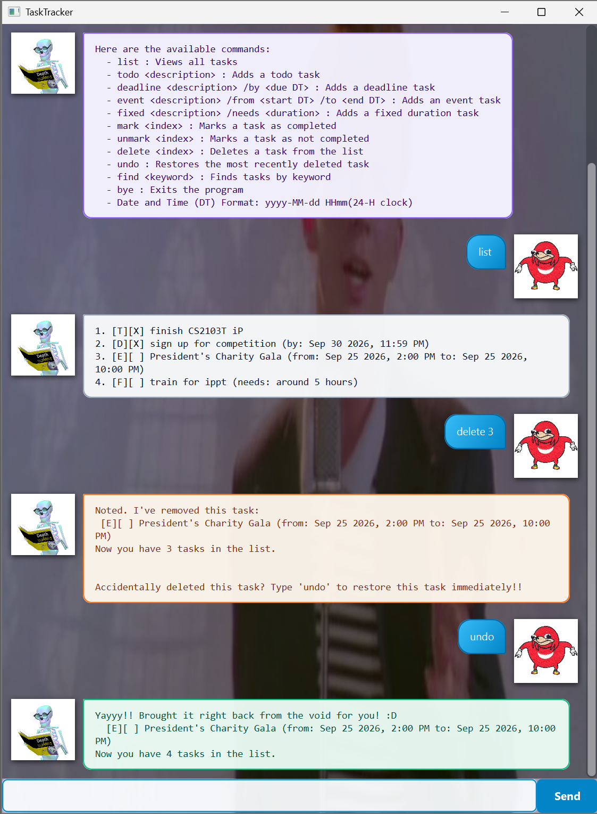
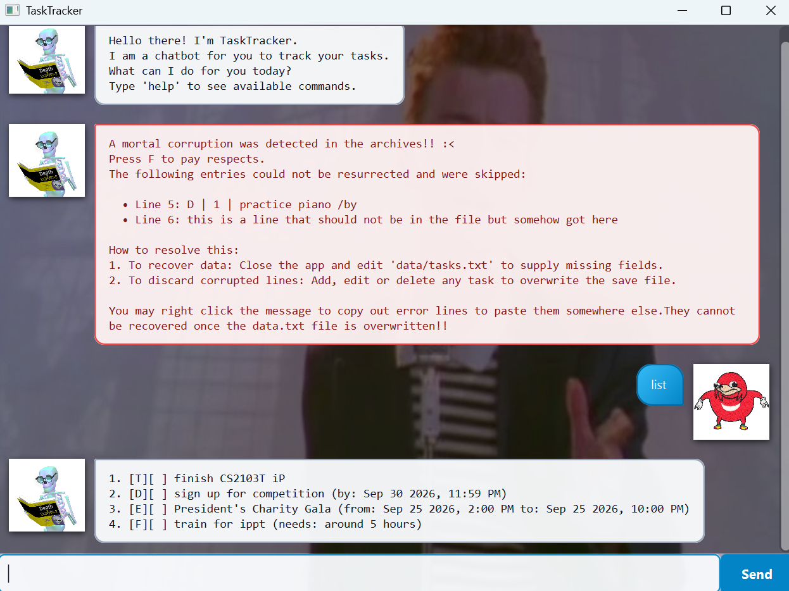

# **TaskTracker - User Guide**

**TaskTracker** is a desktop task management application tailored for tracking task information.

It targets users who prefer interacting via a Command Line Interface (CLI) while benefiting from a visual Graphical User
Interface (GUI).



---

## Quick Start

1. Ensure you have **Java 25** (or above) installed on your computer.
    * Verify your runtime version by executing:
      ```bash
      java -version
      ```
2. Download the latest `TaskTracker.jar` from the releases page.
3. Move the JAR file to an empty folder where you want your task archive stored.
4. Open your terminal, navigate to that directory, and launch the application:
   ```bash
   java -jar TaskTracker.jar
   ```

---

## Using TaskTracker

Type your command into the bottom text field and press **Enter**.

### Available Commands

* `list` : Views all tasks saved
* `todo` : Adds an untimed general task
* `deadline` : Adds a task due before `<due DT>`
* `event` : Adds a task spanning `<start DT>` to `<end DT>`
* `fixed` : Adds a task with an estimated completion duration
* `mark` : Marks a task as completed
* `unmark` : Marks a task as incomplete
* `find` : Finds tasks matching a keyword
* `delete` : Deletes a task by its index number
* `undo` : Restores recently deleted task
* `help` : Shows all available commands
* `bye` : Exits the program

### Date and Time Format

For commands requiring a date and time (`<due DT>`, `<start DT>`, `<end DT>`), use this strict 24-hour format:

```text
Format:  yyyy-MM-dd HHmm
Example: 2026-09-30 2359 (interpreted as September 30, 2026, 11:59 PM)
```

> **Note:** Date validation is strict; invalid calendar days and leap years are strictly checked.

### Editing Previous Commands

Made a typo? Enter `>` into the input box to instantly retrieve and edit your last typed command without having to
retype the whole line.

> **Note:** The prompt to use `>` appears whenever an invalid command is entered. Successfully executed commands run
> their operations immediately with the provided parameters.

---

### 1. Viewing Help

Shows a concise reference sheet of all supported commands.

* **Format:** `help`

Sample input:

```text
help
```

Sample output:

```text
Here are the available commands:
 - list : Views all tasks
 - todo <description> : Adds a todo task
 - deadline <description> /by <due DT> : Adds a deadline task
 - event <description> /from <start DT> /to <end DT> : Adds an event task
 - fixed <description> /needs <duration> : Adds a fixed duration task
 - mark <index> : Marks a task as completed
 - unmark <index> : Marks a task as not completed
 - delete <index> : Deletes a task from the list
 - undo : Restores the most recently deleted task
 - find <keyword> : Finds tasks by keyword
 - bye : Exits the program
 - Date and Time (DT) Format: yyyy-MM-dd HHmm(24-H clock)
```

---

### 2. Listing All Tasks

Displays the complete list of all saved tasks, including their index numbers, types, and completion statuses.

* **Format:** `list`

Sample input:

```text
list
```

Sample output:

```text
1. [T][ ] finish CS2103T iP
2. [D][ ] sign up for competition (by: Sep 30 2026, 11:59 PM)
3. [E][ ] President's Charity Gala (from: Sep 25 2026, 2:00 PM to: Sep 25 2026, 10:00 PM)
4. [F][ ] train for ippt (needs: around 5 hours)
```

> **Note:** If a corrupted save file was previously detected, `list` displays only the records that could be read
> safely.

---

### 3. Adding a ToDo Task

Adds a general task without any date or time constraints.

* **Format:** `todo <description>`

Sample input:

```text
todo finish CS2103T iP
```

Sample output:

```text
Got it. I've added this task:
  [T][ ] finish CS2103T iP
Now you have 1 task in the list.
```

---

### 4. Adding a Deadline Task

Adds a task that must be completed before a specified deadline date and time.

* **Format:** `deadline <description> /by <due DT>`

Sample input:

```text
deadline sign up for competition /by 2026-09-30 2359
```

Sample output:

```text
Got it. I've added this task:
  [D][ ] sign up for competition (by: Sep 30 2026, 11:59 PM)
Now you have 2 tasks in the list.
```

---

### 5. Adding an Event Task

Adds a task that occurs during an active start and end timeframe.

* **Format:** `event <description> /from <start DT> /to <end DT>`

Sample input:

```text
event President's Charity Gala /from 2026-09-25 1400 /to 2026-09-25 2200
```

Sample output:

```text
Got it. I've added this task:
  [E][ ] President's Charity Gala (from: Sep 25 2026, 2:00 PM to: Sep 25 2026, 10:00 PM)
Now you have 3 tasks in the list.
```

---

### 6. Adding a Fixed Duration Task

Adds a task requiring an estimated time allocation to complete.

* **Format:** `fixed <description> /needs <duration>`

Sample input:

```text
fixed train for ippt /needs around 5 hours
```

Sample output:

```text
Got it. I've added this task:
  [F][ ] train for ippt (needs: around 5 hours)
Now you have 4 tasks in the list.
```

---

### 7. Marking a Task

Marks a task at a specific list index as completed.

* **Format:** `mark <index>`

Sample input:

```text
mark 2
```

Sample output:

```text
Nice! I've marked this task as done:
  [D][X] sign up for competition (by: Sep 30 2026, 11:59 PM)
```

---

### 8. Unmarking a Task

Reverts a completed task back to an incomplete status.

* **Format:** `unmark <index>`

Sample input:

```text
unmark 2
```

Sample output:

```text
OK, I've marked this task as not done yet:
  [D][ ] sign up for competition (by: Sep 30 2026, 11:59 PM)
```

---

### 9. Deleting a Task

Permanently deletes a task from your list based on its index number.

* **Format:** `delete <index>`

Sample input:

```text
delete 3
```

Sample output:

```text
Noted. I've removed this task:
  [E][ ] President's Charity Gala (from: Sep 25 2026, 2:00 PM to: Sep 25 2026, 10:00 PM)
Now you have 3 tasks in the list.

Accidentally deleted this task? Type 'undo' to restore this task immediately!!
```

---

### 10. Undoing a Deletion

Restores the task that was just removed back into the active list.

* **Format:** `undo`

Sample input:

```text
undo
```

Sample output:

```text
Yayyy!! Brought it right back from the void for you! :D
  [E][ ] President's Charity Gala (from: Sep 25 2026, 2:00 PM to: Sep 25 2026, 10:00 PM)
Now you have 4 tasks in the list.
```

> **Note:** The undo buffer stores only the single most recently deleted task. Executing any subsequent valid command
> (e.g., `todo`, `mark`, `delete`, `list`) clears the buffer, making that deletion permanent.

---

### 11. Finding Tasks

Searches the archive for any tasks whose descriptions contain the search query.

* **Format:** `find <keyword>`

Sample input:

```text
find Gala
```

Sample output:

```text
Here are the matching tasks in your list:
1. [E][ ] President's Charity Gala (from: Sep 25 2026, 2:00 PM to: Sep 25 2026, 10:00 PM)
```

---

### 12. Exiting the Program

Terminates and closes the application window cleanly.

* **Format:** `bye`

Sample input:

```text
bye
```

Sample output:

```text
Baiiiiiii!!! Cya soon!
```

---

## Handling Corrupted Data Files

If `data/tasks.txt` is manually edited with invalid formats (e.g., missing delimiters, invalid dates), TaskTracker
protects the rest of your list rather than crashing.

### What Happens on Startup



1. **Partial Loading:** TaskTracker loads all valid tasks normally so you do not lose your entire archive.
2. **Startup Alert:** An error bubble appears immediately, listing the specific corrupted line numbers and their
   original text.

### How to Recover Corrupted Lines

1. **Copy the Line:** Right-click the error bubble in the chat window and select **Copy Corrupted Lines** (or Copy Full
   Message) to save your notes to your system clipboard.
2. **Fix Before Modifying:** If you execute any command that modifies the list (such as `todo` or `delete`), TaskTracker
   rewrites `data/tasks.txt` with only the valid tasks currently in memory. Make sure to copy any unreadable text
   beforehand so you can re-add it cleanly via the CLI.

---

### Save File Format Reference

TaskTracker stores entries in `data/tasks.txt` using a pipe-delimited (`|`) format. Each line represents an individual
task composed of the following fields:

```text
TASK_TYPE | IS_DONE | DESCRIPTION [| EXTRA_FIELDS...]
```

* **`TASK_TYPE`**: A single-character identifier:
    * `T` — ToDo task
    * `D` — Deadline task
    * `E` — Event task
    * `F` — Fixed Duration task
* **`IS_DONE`**: `0` for incomplete, `1` for completed.
* **`DESCRIPTION`**: The textual summary of the task.
* **`EXTRA_FIELDS`**: Additional arguments depending on task type:
    * **Deadline (`D`)**: Appends the deadline timestamp.  
      *Format:* `D | IS_DONE | DESCRIPTION | yyyy-MM-dd HHmm`  
      *Example:* `D | 0 | return book | 2026-09-30 2359`
    * **Event (`E`)**: Appends the start and end timestamps.  
      *Format:* `E | IS_DONE | DESCRIPTION | yyyy-MM-dd HHmm | yyyy-MM-dd HHmm`  
      *Example:* `E | 0 | project gala | 2026-09-25 1400 | 2026-09-25 2200`
    * **Fixed Duration (`F`)**: Appends the expected duration string.  
      *Format:* `F | IS_DONE | DESCRIPTION | DURATION`  
      *Example:* `F | 0 | train for ippt | around 5 hours`

> **Note on Argument Counts:** Each task type strictly requires its exact number of fields (`T`: 3, `D`: 4, `E`: 5,
> `F`: 4). Any line containing missing or superfluous delimited segments will fail to parse and trigger a corruption
> alert.

### Troubleshooting Common File Errors

If a line fails to load, check the copied text against these typical mistakes:

* **Missing Delimiters:** Ensure every field is separated by a pipe surrounded by spaces (` | `).
* **Invalid Completion Flag:** Only `0` or `1` is accepted for `IS_DONE`. Values like `true`, `false`, or `X` will cause
  parsing to fail.
* **Date-Time Formatting:** Timestamps must match `yyyy-MM-dd HHmm` in 24-hour time. Ensure the date is valid on the
  calendar (e.g., February 29 on non-leap years will be rejected).

---

## Acknowledgements

* TaskTracker was developed as part of **Project Duke**, an educational software engineering initiative under CS2103/T.
* The original concept is named in honor of **Duke**, the Java Mascot (courtesy of Oracle / Sun Microsystems).
* GUI framework and architectural structure adapted from the [se-edu/duke](https://github.com/se-edu/duke) tutorial
  project.
* **AI Usage:** Gemini Flash 3.8 was used as an interactive guidance agent and sounding board for this project. Ideas on
  extending the project scope, design trade-offs, and final code implementations were driven by myself (a human,
  thankfully, or at least I hope). All code and documentation were produced through deliberate human iteration, manual
  refinement, and testing rather than pure automation.
